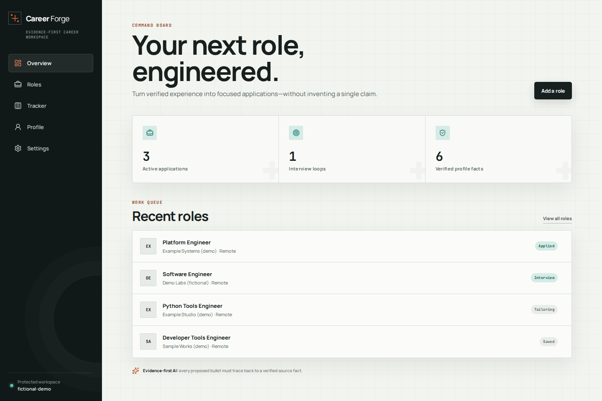
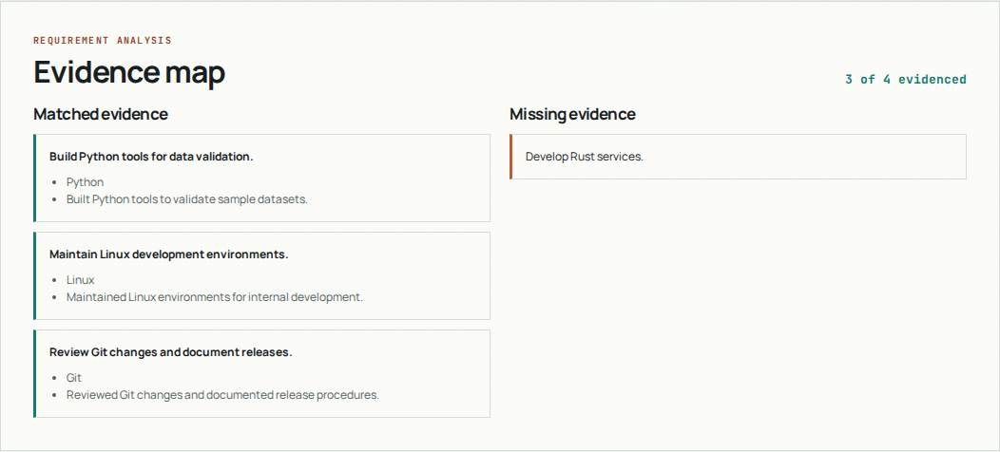
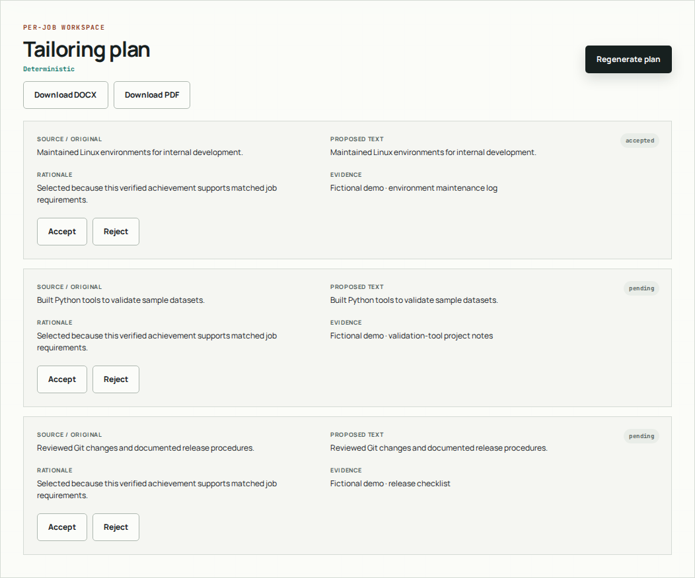
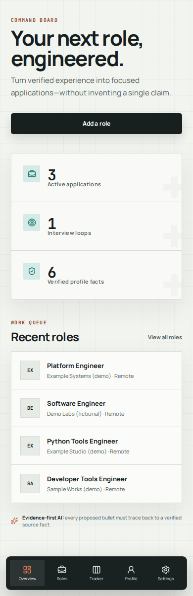

<div align="center">

```text
   +--------------------------------------------------+
   |  C A R E E R   F O R G E                          |
   |                                                  |
   |       verified facts  ->  focused applications    |
   |                         /\                       |
   |                    ____/  \____                  |
   |                    \__________/                  |
   |                       |____|                     |
   +--------------------------------------------------+
```

# Career Forge

**Build your application around evidence, not invented qualifications.**

[](LICENSE)
[](package.json)
[](#architecture)
[](.github/workflows/ci.yml)

[Workflow](#workflow) · [Setup](docs/setup.md) · [Security](docs/security.md) · [Contributing](#contributing)

</div>

Career Forge is a self-hosted job-search workspace: maintain a verified career profile, compare it with a job's requirements, review targeted resume versions, and track applications in one place. Deterministic tailoring works without an AI account.

The source is MIT-licensed and prepared for the intended repository [`spherohero/career-forge`](https://github.com/spherohero/career-forge). Public publication is a separate release gate. The live workspace remains private behind Authelia; source availability does not grant access to it.

> **Privacy boundary:** authorized users share the career workspace. Only Codex connections are per identity. Resume text, profiles, jobs, versions, and history are stored in plaintext SQLite—not an encrypted, multi-tenant vault.

## Screenshots

Actual production-mode UI with entirely fictional demonstration data. The tailoring shown is deterministic—not a simulated successful AI response. See [screenshot provenance](docs/assets/PROVENANCE.md).



### Match requirements to evidence



### Review wording against its source



<details>
<summary>Mobile workspace</summary>



</details>

## Workflow

1. **Establish the facts.** Enter skills, experience, projects, and education. Optionally extract a PDF, DOCX, or UTF-8 TXT resume into a separate `pending_review` draft; manually review and attest its facts.
2. **Add a job.** Paste the posting and review normalized requirements, weighted fit analysis, matching evidence, and gaps. A fit score is a heuristic, not a hiring prediction.
3. **Generate a plan.** Select relevant verified achievements with stable source IDs. Optional model assistance passes through the same fail-closed validation boundary.
4. **Review each proposal.** Accept or reject wording against its original evidence. Pending and rejected proposals retain the source wording.
5. **Export and track.** Download a one-column, selectable-text DOCX or PDF from a resume version; update the application pipeline and event history.

## What is implemented

| Area | Behavior |
| --- | --- |
| Profile | Verified skills, experience, projects, and education with achievement provenance |
| Import | Server-side text extraction, 4 MiB limit, extension/MIME checks, separate review queue; no OCR or automatic verification |
| Job workspace | Manual job entry, requirement normalization, evidence-linked fit analysis and gaps |
| Tailoring | Deterministic plans, optional guarded model proposals, explicit accept/reject decisions |
| Export | ATS-oriented DOCX/PDF layout with standard headings and selectable text; no guarantee of every ATS's behavior |
| Tracker | Application status changes and event history |
| Settings | Experimental per-user Codex device authorization, model identifier text field, local disconnect |
| Operations | SQLite persistence, trusted-proxy authorization, parameterized production Compose example |

### AI assistance, deliberately constrained

The current validator permits **presentation-equivalent claim text**, not semantic rewriting. Source and proposal must match after Unicode NFC normalization, whitespace collapse/trim, and removal of terminal `.`, `!`, and `?`. Additional numeric and claim checks apply. Changes to words, case, internal punctuation, ordering, attribution, metrics, or meaning are rejected—even if a human might consider them harmless paraphrases.

Invalid output discards the entire model response and returns the deterministic plan. The model cannot edit profile facts or make review decisions. This is a narrow wording gate, not a general-purpose factuality verifier.

**Experimental Codex OAuth:** an authorized user can connect through OpenAI's device-code flow in Settings. This is not generic “Sign in with ChatGPT,” and it does not turn a ChatGPT subscription into general API billing credit. Plan eligibility, model access, and quota accounting are not guaranteed; real upstream OAuth/inference compatibility is not claimed verified here. The model is entered as text, not selected from a dynamically discovered catalog.

When OAuth is enabled, missing credentials, misconfiguration, authorization/refresh errors, or inference failure lead to deterministic tailoring—**never a silent switch to an administrator's provider**. The optional administrator OpenAI-compatible provider is eligible only while OAuth is disabled. See [provider setup](docs/setup.md#optional-model-connections) and [data disclosure](docs/security.md#model-data-and-validation).

## Quick start

From a local checkout, with **Node.js 22+** and npm:

```bash
cp .env.example .env.local
npm ci
npm run dev -- --hostname 127.0.0.1
```

Open <http://127.0.0.1:3000>. The development default disables authentication and uses `./data/career-forge.db`; keep this server loopback-only and use synthetic data when demonstrating it. Do not expose it through a public tunnel or unprotected proxy.

For production, use [the setup guide](docs/setup.md#production-compose), an authenticated TLS reverse proxy, and no published application port. Compose does not install Traefik or Authelia for you.

## Architecture

```text
Browser
   |
TLS reverse proxy + Authelia
   | trusted identity headers; isolated proxy network
   v
Next.js App Router / Server Actions / download routes
   |                         |
   v                         v
SQLite shared workspace     Optional provider selection
+ encrypted per-user       + Codex OAuth for this identity
  OAuth credential fields  OR admin API (OAuth disabled)
                             |
                             v
                         Claim validator
                             |
                             v
                      Reviewable resume version
```

TypeScript, React, and Next.js provide the UI and server boundary. `better-sqlite3` stores the workspace. The Dockerfile defines a non-root standalone Next.js runtime with persistent `/app/data`; the Compose example adds a read-only root filesystem, dropped capabilities, and no host-port publication. These are source configuration facts, not a claim that runtime image packaging or a deployment has been verified.

Trust is enforced at pages, Server Actions, and export routes. `/api/health` bypasses application header checks for container health; it must still sit behind authentication at the public proxy. Read [the security model](docs/security.md) before deploying.

## Verification

```bash
npm run check
npm run test:coverage
git diff --check
```

`check` runs ESLint, TypeScript, Vitest, and a production build. Coverage is a separate command. Synthetic browser QA was performed separately using external harnesses; there is currently no checked-in Playwright suite or configuration. The `test:e2e` script is a runner entry point, not an established verification gate. The [CI definition](.github/workflows/ci.yml) includes `verify` and `container` jobs; a workflow link is not evidence of a passing run.

## Contributing

Read [AGENTS.md](AGENTS.md) before changing code, including its instruction to consult the installed Next.js documentation. Keep changes focused, add regression tests for behavior changes, and run the verification gates above. Use synthetic fixtures and reserved example identities; never attach personal resumes, database files, device codes, tokens, or deployment secrets to issues or pull requests.

Preserve the shared-workspace authorization boundary, per-identity credential ownership, explicit provider selection, and fail-closed claim validation. Security-sensitive reports should be coordinated privately with the maintainer rather than published with exploitable details or private data.

### Possible next steps—not current features

- Optional model discovery, subject to upstream compatibility and bounded parsing.
- Broader rewriting only after a stronger factual verification design and regression coverage—not by relaxing the current equality gate.
- A checked-in reproducible browser test suite and independently verified release/deployment evidence.

## License

Career Forge source is available under the [MIT License](LICENSE). Distributed fonts retain their own SIL Open Font License terms; see [Third-Party Notices](THIRD_PARTY_NOTICES.md). No affiliation with or endorsement by OpenAI is implied.
